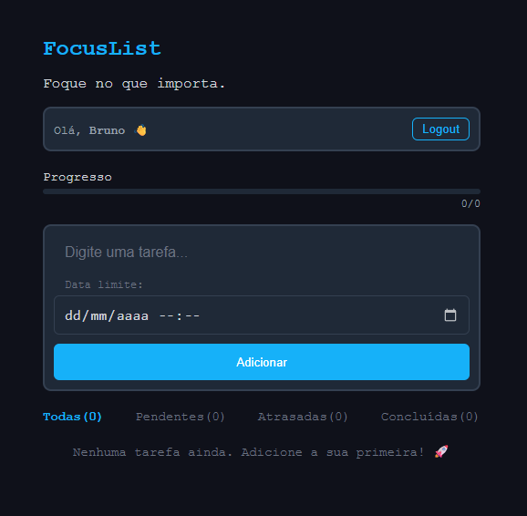
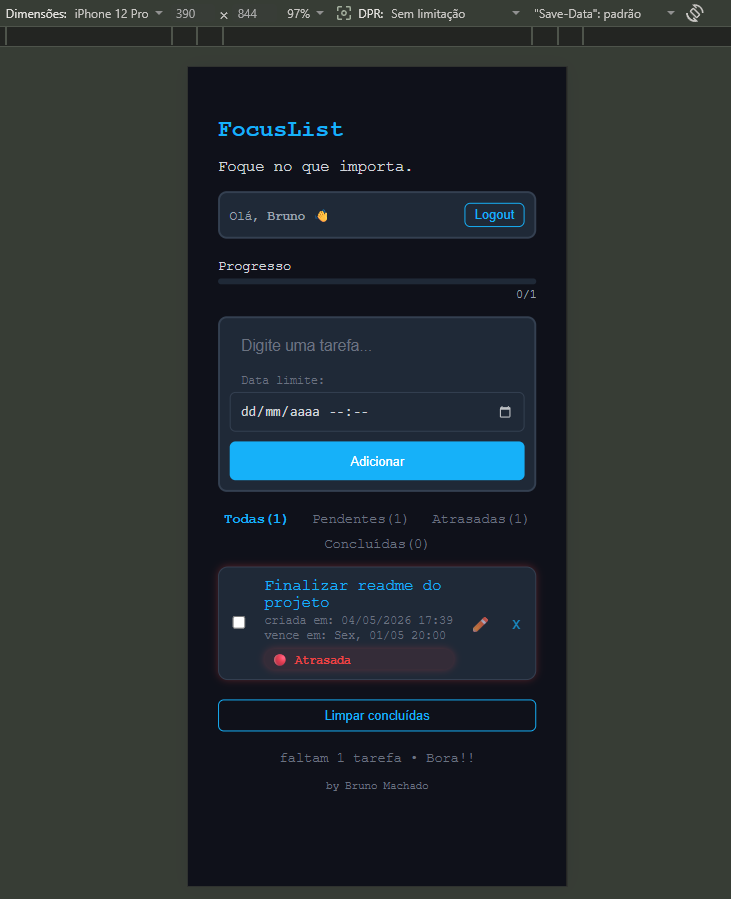
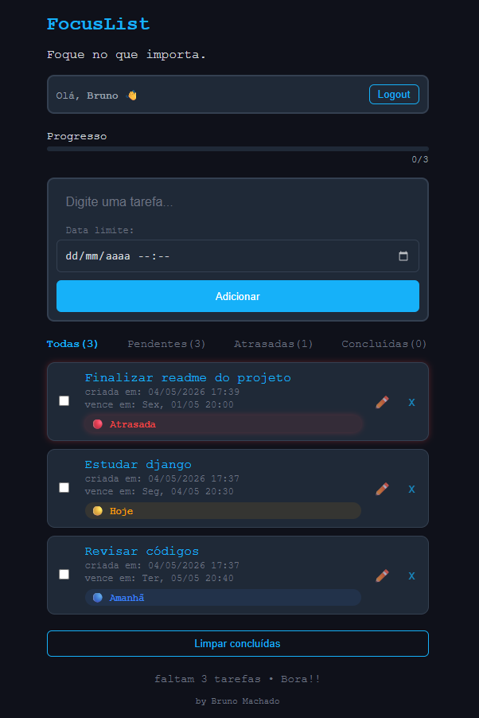
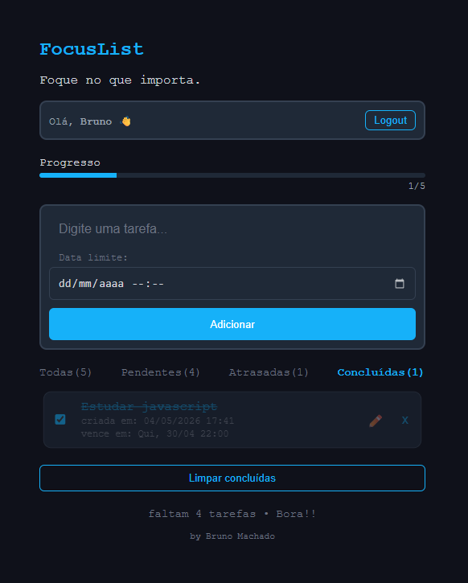

# 📝 FocusList

Aplicação web de gerenciamento de tarefas (To-Do List) com foco em produtividade, organização e experiência do usuário.

🔗 **Acesse online:**
https://focuslist-pd85.onrender.com

---

## 🚀 Funcionalidades

* 🔐 Cadastro e autenticação de usuários
* 📝 Criação, edição e exclusão de tarefas
* ✔️ Marcar tarefas como concluídas
* ⏰ Definição obrigatória de data e hora limite
* ✏️ Edição com salvamento automático (auto-save)
* 🚨 Destaque automático de tarefas atrasadas
* 🏷️ Badges inteligentes:

  * 🔴 Atrasada
  * 🟡 Hoje
  * 🔵 Amanhã
* 📊 Barra de progresso
* 🔎 Filtros por status:

  * Todas
  * Pendentes
  * Atrasadas
  * Concluídas
* 🔢 Contadores dinâmicos por filtro
* 📱 Layout responsivo (mobile-first)

---

## 🎯 Diferenciais

* Ordenação automática por prioridade (tarefas mais próximas primeiro)
* Feedback visual claro (cores, badges e estados)
* UX moderna com auto-save ao editar
* Separação entre username e nome exibido
* Projeto publicado com banco real (PostgreSQL)
* Código limpo e organizado

---

## 🛠️ Tecnologias

* Python
* Django
* HTML5
* CSS3
* JavaScript
* PostgreSQL
* WhiteNoise
* Render

---

## ⚙️ Rodando localmente

```bash
git clone https://github.com/brunoma01/focuslist.git
cd focuslist

python -m venv venv
venv\Scripts\activate

pip install -r requirements.txt
python manage.py migrate
python manage.py runserver
```

---

## 🔐 Admin

```bash
python manage.py createsuperuser
```

Acesse:
`/admin`

---

## 📸 Preview

### 🖥️ Tela principal



### 📱 Versão mobile



### 🟡 Hoje / Amanhã / Atrasada



### 🔎 Filtros



---

## 👨‍💻 Autor

Bruno Machado de Almeida
📍 Florianópolis - SC

---
